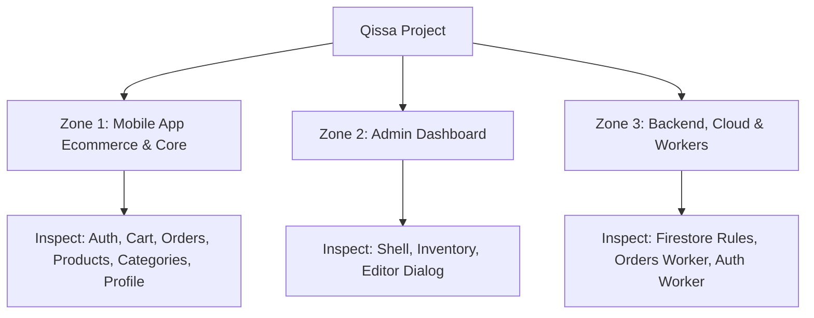

# Project Search Map & Bug Hunting Plan (Updated - No AI Chat)

بناءً على طلبك، قمنا باستبعاد نظام الدردشة الذكي (AI Chat) بالكامل من خطة البحث الحالية. سنركز جهودنا على فحص وتحسين الميزات الأساسية واللوحات الإدارية والقواعد الأمنية للمشروع.

---

## User Review Required

> [!NOTE]
> هذا المخطط مصمم ليتوافق مع قيود الأمان المحددة في [AGENTS.md](file:///f:/Qissa_Graduation_Project/AGENTS.md). لن نقوم بإجراء أي تعديلات على الكود أو تشغيل أوامر برمجية حساسة إلا بعد مراجعتك وموافقتك الصريحة على هذه الخطة.

> [!WARNING]
> تعتبر منطقة **Backend and Cloud Workers (Zone 3)** منطقة حساسة للغاية (Sensitive Zone). أي فحص أو تعديل فيها سيتطلب حرصاً شديداً وتوضيحاً مسبقاً للمخاطر الأمنية قبل التعديل.

---

## Proposed Search Zones (خريطة مناطق البحث الجديدة)

### Zone 1: Mobile App Ecommerce & Core
تغطي هذه المنطقة رحلة المستخدم الأساسية بالكامل داخل تطبيق الهاتف من التسجيل إلى الشراء ومتابعة الطلبات.

#### Key Files to Inspect:
- [product_model.dart](file:///f:/Qissa_Graduation_Project/mobile_app/lib/features/products/data/models/product_model.dart)
- [categories_page.dart](file:///f:/Qissa_Graduation_Project/mobile_app/lib/features/categories/presentation/pages/categories_page.dart)
- [main.dart](file:///f:/Qissa_Graduation_Project/mobile_app/lib/main.dart)

#### Search Objectives:
1. مراجعة دوال معالجة الأخطاء (Error Handlers) أثناء تسجيل الدخول وطلب الـ OTP وتعديل الملف الشخصي.
2. فحص منطق تعديل محتويات السلة وتحديثها بشكل فوري.
3. التأكد من منطق الأسعار والعملات وحسابات الشحن إن وجدت.
4. مراجعة حالات إلغاء الطلبات أو تتبع حالتها بشكل صحيح.

---

### Zone 2: Admin Dashboard
لوحة التحكم الخاصة بمدير النظام لمراقبة المخزون وإدارة المنتجات وتحديث بياناتها في Firestore.

#### Key Files to Inspect:
- [inventory_page.dart](file:///f:/Qissa_Graduation_Project/admin_dashboard/lib/features/admin/presentation/pages/inventory_page.dart)
- [admin_product_editor_dialog.dart](file:///f:/Qissa_Graduation_Project/admin_dashboard/lib/features/admin/presentation/widgets/admin_product_editor_dialog.dart)
- [admin_shell.dart](file:///f:/Qissa_Graduation_Project/admin_dashboard/lib/features/admin/presentation/pages/admin_shell.dart)

#### Search Objectives:
1. التحقق من تكامل حقول إدخال وتعديل المنتجات (Product Editor validations).
2. فحص استدعاءات Firestore والتأكد من التحديث اللحظي للبيانات.
3. التأكد من سلامة معالجة رفع الصور أو حفظ البيانات لتفادي الـ Crashes.

---

### Zone 3: Backend, Cloud, & Workers
منطقة معالجة الطلبات، وقواعد الأمان لـ Firestore، والـ Workers الخاصة بالعمليات الأساسية (التحقق والطلب). **هذه منطقة حساسة للغاية.**

#### Key Files to Inspect:
- [firestore.rules](file:///f:/Qissa_Graduation_Project/backend_and_cloud/rules/firestore.rules)
- الـ Workers الخاصة بـ Orders و Auth في `backend_and_cloud/workers/`

#### Search Objectives:
1. مراجعة قواعد الأمان (Security Rules) لضمان منع الوصول غير المصرح به لقراءة أو كتابة الطلبات.
2. فحص الـ OTP flow والتأكد من إرسال رسائل التحقق عبر الـ Auth Worker بنجاح.
3. التحقق من منطق تعديل المخزون في الـ Orders Worker عند إتمام الطلب أو إلغائه.

---

## Verification Plan

للتأكد من سلامة الكود وعدم إدخال أي أخطاء تراجعية (Regressions):

### Automated Tests
- **Zone 1**: `flutter test` داخل مجلد `mobile_app/`
- **Zone 2**: `flutter test` داخل مجلد `admin_dashboard/`
- **Zone 3**:
  - `npm test` لـ Workers
  - `firebase emulators:exec --only firestore "npm --prefix functions run test:rules"` لقواعد Firestore.

### Manual Verification
- التحقق اليدوي من رحلة الشراء الكاملة وحسابات السلة.
- التحقق اليدوي من لوحة تحكم الأدمن وتنعكس التغييرات في Firestore.
